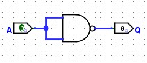
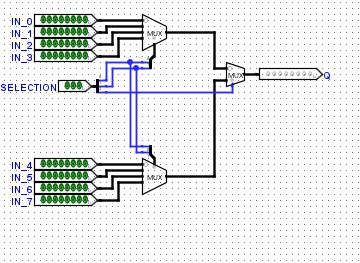
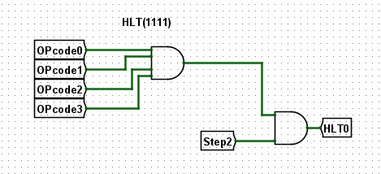

# 디지털 논리 회로 설명서

이 문서는 PIC 폴더에 있는 디지털 논리 회로 이미지들에 대한 설명입니다.

## 목차
1. [기본 논리 게이트](#1-기본-논리-게이트)
2. [산술 연산 회로](#2-산술-연산-회로)
3. [멀티플렉서 (MUX)](#3-멀티플렉서-mux)
4. [디코더](#4-디코더)
5. [메모리/래치 회로](#5-메모리래치-회로)
6. [버퍼](#6-버퍼)
7. [ALU](#7-alu-산술논리연산장치)
8. [클록](#8-클록)
9. [레지스터](#9-레지스터)
10. [메모리 시스템](#10-메모리-시스템)
11. [제어 유닛 및 카운터](#11-제어-유닛-및-카운터)
12. [컴퓨터 아키텍처](#12-컴퓨터-아키텍처)
13. [CPU 명령어 구현](#13-cpu-명령어-구현)
14. [출력 레지스터](#14-출력-레지스터)
15. [예제](#15-예제)

---

## 1. 기본 논리 게이트

### AND게이트.jpg


- **기능**: 논리곱 연산 수행
- **입력**: A, B (2개)
- **출력**: Q = A AND B
- **특징**: 두 입력이 모두 1일 때만 출력이 1

### OR게이트.jpg


- **기능**: 논리합 연산 수행
- **입력**: A, B (2개)
- **출력**: Q = A OR B
- **특징**: 입력 중 하나라도 1이면 출력이 1

### NOT게이트.jpg



- **기능**: 논리 반전 (인버터)
- **입력**: A (1개)
- **출력**: Q = NOT A
- **특징**: 입력을 반대로 변환 (0→1, 1→0)

### NAND게이트.jpg


- **기능**: NOT AND 연산
- **입력**: A, B (2개)
- **출력**: Q = NOT(A AND B)
- **특징**: 피드백 루프로 구현됨, 범용 게이트

### XOR게이트.jpg


- **기능**: 배타적 논리합 연산
- **입력**: A, B (2개)
- **출력**: Q = A XOR B
- **구성**: 4개의 NAND 게이트 (n1, n2, n3, n4)로 구현
- **특징**: 두 입력이 다를 때 출력이 1

---

## 2. 산술 연산 회로

### Half_Adder.jpg


- **기능**: 1비트 반가산기
- **입력**: IN_A, IN_B
- **출력**:
  - Sum (합)
  - Carry (자리올림)
- **구성**: AND 게이트 + XOR 게이트
- **특징**: 이전 자리의 캐리를 고려하지 않음

### Full_Adder.jpg


- **기능**: 1비트 전가산기
- **입력**: IN_A, IN_B, IN_C (캐리 입력)
- **출력**:
  - Sum (합)
  - Carry (자리올림)
- **구성**: 2개의 Half Adder로 구성
- **특징**: 3개의 입력을 모두 더할 수 있음

---

## 3. 멀티플렉서 (MUX)

### MUX.jpg


- **기능**: 2:1 멀티플렉서
- **입력**: A, B, Selection
- **출력**: Q
- **특징**: Selection 신호에 따라 A 또는 B를 출력으로 선택

### MUX8.jpg


- **기능**: 8비트 2:1 멀티플렉서
- **입력**: IN_A[7:0], IN_B[7:0], Selection
- **출력**: OUT[7:0]
- **특징**: 8개의 1비트 MUX를 병렬로 사용

### MUX8X4.jpg


- **기능**: 4:1 8비트 멀티플렉서
- **입력**: IN_0, IN_1, IN_2, IN_3 (각 8비트), SELECTION[1:0]
- **출력**: Q (8비트)
- **특징**: 4개의 8비트 입력 중 하나 선택

### MUX8X8.jpg



- **기능**: 8:1 8비트 멀티플렉서
- **입력**: IN_0 ~ IN_7 (각 8비트), SELECTION[2:0]
- **출력**: Q (8비트)
- **특징**: 8개의 8비트 입력 중 하나 선택

### MUX8X16.jpg


- **기능**: 16:1 8비트 멀티플렉서
- **입력**: IN_0 ~ IN_15 (각 8비트), SELECTION[3:0]
- **출력**: Q (8비트)
- **특징**: 계층적 구조로 구현, 16개의 입력 중 하나 선택

---

## 4. 디코더

### Decoder3In.jpg


- **기능**: 3-to-8 디코더
- **입력**: SELECTION[2:0], ENABLE
- **출력**: OUT0 ~ OUT7 (8개)
- **특징**: 3비트 입력을 8개 출력 중 하나로 변환

### Decoder4In.jpg


- **기능**: 4-to-16 디코더
- **입력**: SELECTION[3:0], ENABLE
- **출력**: OUT0 ~ OUT15 (16개)
- **특징**: 4비트 입력을 16개 출력 중 하나로 변환, ENABLE 신호로 활성화 제어

---

## 5. 메모리/래치 회로

### SRLatch.jpg


- **기능**: SR 래치 (Set-Reset Latch)
- **입력**: S (Set), R (Reset)
- **출력**: Q
- **구성**: 2개의 NOR 게이트로 교차 결합
- **특징**: 1비트 데이터 저장, 비동기 메모리 소자

### GatedSRLatch.jpg


- **기능**: 게이트 제어 SR 래치
- **입력**: S (Set), E (Enable), R (Reset)
- **출력**: Q
- **구성**: SR 래치 + AND 게이트
- **특징**: Enable 신호가 활성화될 때만 동작

### DLatch.jpg


- **기능**: D 래치 (Data Latch)
- **입력**: D (Data), E (Enable)
- **출력**: Q
- **구성**: Gated SR Latch + NOT 게이트
- **특징**: D 입력을 저장, Enable이 활성화될 때 D 값을 출력에 반영

### JKLatch.jpg


- **기능**: JK 래치
- **입력**: J, K, E (Enable)
- **출력**: Q
- **구성**: SR 래치의 개선형
- **특징**: J=1, K=1일 때 토글 동작, SR 래치의 불확정 상태 문제 해결

---

## 6. 버퍼

### ControlledBuffer.jpg


- **기능**: 제어 가능한 버퍼
- **입력**: Data_In, Enable
- **출력**: Data_Out
- **특징**: Enable 신호로 데이터 통과 여부 제어, 트라이스테이트 버퍼

### ControlledBuffer8.jpg


- **기능**: 8비트 제어 버퍼
- **입력**: Data_In[7:0], Enable
- **출력**: Data_Out[7:0]
- **특징**: 8개의 1비트 버퍼를 병렬로 구성, 버스 제어에 사용

---

## 7. ALU (산술논리연산장치)

### ALU.jpg


- **기능**: 8비트 산술논리연산장치
- **구성 요소**:
  - 8개의 ALU 슬라이스 (각각 Full Adder 포함)
  - Zero Checker (제로 검출기)
  - 제어 신호 입력부
- **연산 종류**:
  - 산술 연산: 덧셈, 뺄셈
  - 논리 연산: AND, OR, XOR
- **출력**:
  - 연산 결과
  - Carry Flag
  - Zero Flag
- **특징**: CPU의 핵심 구성 요소, 다양한 연산을 하나의 회로로 처리

---

## 8. 클록

### CLOCK0.jpg


- **기능**: 클록 신호 생성기
- **출력**: CLK (주기적인 펄스 신호)
- **특징**: 순차 논리 회로의 동기화를 위한 타이밍 신호 제공, 시스템 전체의 타이밍 기준

---

## 9. 레지스터

### Register8HighLevel.jpg


- **기능**: 8비트 레지스터
- **입력**: IN[7:0], SET (쓰기 제어), ENABLE (읽기 제어), CLK
- **출력**: OUT[7:0]
- **구성**: 8개의 D Latch (또는 D Flip-Flop)로 구성
- **특징**:
  - 8비트 데이터 저장
  - SET 신호로 데이터 쓰기
  - ENABLE 신호로 데이터 읽기 제어
  - 클록 동기화 동작

---

## 10. 메모리 시스템

### RAM8X16HighLevel.jpg


- **기능**: 8비트 × 16워드 RAM
- **입력**:
  - IN[7:0] (데이터 입력)
  - ADDRESS[3:0] (주소 선택)
  - SET (쓰기 제어)
  - ENABLE (읽기 제어)
  - CLK
- **출력**: OUT[7:0]
- **구성**:
  - 16개의 8비트 레지스터
  - 4-to-16 디코더 (주소 디코딩)
  - 16:1 멀티플렉서 (데이터 선택)
- **특징**:
  - 총 128비트 (16바이트) 저장 용량
  - 랜덤 액세스 메모리
  - 주소로 특정 워드 선택 가능

---

## 11. 제어 유닛 및 카운터

### PC.jpg


- **기능**: 프로그램 카운터 (Program Counter)
- **입력**:
  - IN[7:0] (점프 주소)
  - INC (증가 신호)
  - JMP (점프 신호)
  - CLK
- **출력**: OUT[7:0] (현재 명령어 주소)
- **특징**:
  - 다음 실행할 명령어의 주소 저장
  - INC 신호로 순차적 증가
  - JMP 신호로 특정 주소로 점프
  - CPU의 제어 흐름 관리

### SC.jpg


- **기능**: 단계 카운터 (Step Counter)
- **입력**: CLK, RESET
- **출력**: 단계 신호들
- **특징**:
  - 명령어 실행 사이클을 단계별로 관리
  - 각 단계에서 필요한 제어 신호 생성
  - Fetch-Decode-Execute 사이클 제어

### CU.jpg


- **기능**: 제어 유닛 (Control Unit)
- **입력**:
  - 명령어 코드
  - 단계 카운터 신호
  - 플래그 (Zero, Carry 등)
- **출력**: 제어 신호들
- **특징**:
  - CPU의 두뇌 역할
  - 명령어를 해독하고 실행을 위한 제어 신호 생성
  - ALU, 메모리, 레지스터 등 모든 구성 요소 제어
  - 단계 카운터와 협력하여 명령어 실행 사이클 관리

---

## 12. 컴퓨터 아키텍처

### ComputerWithoutCU.jpg


- **기능**: 제어 유닛 없는 컴퓨터 구조
- **구성 요소**:
  - ALU (산술논리연산장치)
  - 레지스터들
  - 메모리 (RAM)
  - 버스 시스템
- **특징**:
  - 기본적인 컴퓨터 데이터패스 구조
  - 제어 유닛을 제외한 모든 하드웨어 구성 요소 포함
  - 수동 제어 신호 입력으로 동작 가능

### ComputerWithoutCUupdate.jpg


- **기능**: 제어 유닛 없는 컴퓨터 구조 (업데이트 버전)
- **개선 사항**:
  - 향상된 버스 구조
  - 추가 레지스터 또는 구성 요소
  - 최적화된 연결 구조
- **특징**: ComputerWithoutCU.jpg의 개선 버전

---

## 13. CPU 명령어 구현

이 섹션에서는 CPU가 실행하는 각 명령어의 회로 구현을 보여줍니다.

### NOP,LOADA.jpg


- **기능**: NOP (No Operation)와 LOADA 명령어 비교
- **NOP**: 아무 동작도 하지 않음
- **LOADA**: 메모리에서 A 레지스터로 데이터 로드
- **특징**: 가장 기본적인 명령어 구현 예시

### LOADA.jpg


- **기능**: Load A 명령어
- **동작**: RAM[address] → A 레지스터
- **제어 신호**:
  - RAM ENABLE: 1 (메모리 읽기)
  - A SET: 1 (A 레지스터 쓰기)
- **특징**: 메모리에서 데이터를 읽어 누산기(A)에 저장

### LOADAI.jpg


- **기능**: Load A Immediate (즉시 값 로드)
- **동작**: 명령어에 포함된 즉시 값 → A 레지스터
- **제어 신호**:
  - IR 출력 활성화
  - A SET: 1
- **특징**: 메모리 접근 없이 명령어 내부의 값을 직접 로드

### ADD.jpg


- **기능**: 덧셈 명령어
- **동작**: A + RAM[address] → A
- **제어 신호**:
  - RAM ENABLE: 1
  - ALU 덧셈 모드
  - A SET: 1
- **특징**: 메모리의 값을 A에 더하고 결과를 A에 저장

### SUB.jpg


- **기능**: 뺄셈 명령어
- **동작**: A - RAM[address] → A
- **제어 신호**:
  - RAM ENABLE: 1
  - ALU 뺄셈 모드
  - A SET: 1
- **특징**: A에서 메모리 값을 빼고 결과를 A에 저장

### STOREA.jpg


- **기능**: Store A 명령어
- **동작**: A 레지스터 → RAM[address]
- **제어 신호**:
  - A ENABLE: 1
  - RAM SET: 1 (메모리 쓰기)
- **특징**: 누산기의 값을 메모리에 저장

### JMP.jpg


- **기능**: 무조건 점프 (Jump)
- **동작**: PC ← address
- **제어 신호**:
  - PC JMP: 1
- **특징**: 프로그램 카운터를 지정된 주소로 변경하여 무조건 분기

### JMPC.jpg


- **기능**: Carry 플래그가 1이면 점프
- **동작**: if (Carry == 1) then PC ← address
- **제어 신호**:
  - Carry 플래그 검사
  - 조건 만족 시 PC JMP: 1
- **특징**: 조건부 분기 (덧셈 오버플로우 검사)

### JMPZ.jpg


- **기능**: Zero 플래그가 1이면 점프
- **동작**: if (Zero == 1) then PC ← address
- **제어 신호**:
  - Zero 플래그 검사
  - 조건 만족 시 PC JMP: 1
- **특징**: 조건부 분기 (연산 결과가 0인지 검사)

### OUT.jpg


- **기능**: 출력 명령어
- **동작**: A 레지스터 → 출력 레지스터
- **제어 신호**:
  - A ENABLE: 1
  - OUT SET: 1
- **특징**: 누산기의 값을 출력 장치로 전송

### HLT.jpg



- **기능**: Halt (정지) 명령어
- **동작**: 프로그램 실행 중지
- **제어 신호**:
  - CLOCK HALT: 1
- **특징**: 클록을 중지하여 CPU 실행을 멈춤

---

## 14. 출력 레지스터

### Output Register.jpg


- **기능**: 출력 전용 8비트 레지스터
- **입력**: IN[7:0], SET, CLK
- **출력**: OUT[7:0] (7-세그먼트 디스플레이 등에 연결)
- **특징**:
  - CPU 연산 결과를 외부로 출력
  - 사용자가 볼 수 있는 유일한 레지스터
  - 클록 동기화 동작

### controllunit.jpg


- **기능**: 완전한 제어 유닛 구현
- **입력**:
  - 명령어 레지스터 (IR)
  - 단계 카운터 (SC)
  - 플래그 (Zero, Carry)
- **출력**: 모든 제어 신호
- **구성**:
  - 명령어 디코더
  - 제어 신호 생성 로직
  - 조건부 분기 제어
- **특징**:
  - 모든 명령어의 실행을 조율
  - Fetch-Decode-Execute 사이클 관리
  - CPU의 두뇌 역할

---

## 15. 예제

### Example.jpg


- **기능**: 회로 설계 예제
- **특징**:
  - 실제 회로 구성 예시
  - 다양한 구성 요소들의 결합 방법 시연
  - 학습 및 참고용 샘플

---

## 회로 설계 계층 구조

```
Level 1: 기본 논리 게이트
├─ AND, OR, NOT, NAND, XOR
└─ 모든 디지털 회로의 기초

Level 2: 조합 논리 회로
├─ Half Adder, MUX, Buffer
├─ Decoder
└─ 입력에 따라 즉시 출력 결정

Level 3: 순차 논리 회로
├─ SR Latch, Gated SR Latch
├─ D Latch, JK Latch
├─ Clock
└─ 상태를 저장하는 메모리 소자

Level 4: 메모리 시스템
├─ 8-bit Register
├─ RAM (8×16)
├─ Output Register
└─ 데이터 저장 및 관리

Level 5: 산술 논리 장치
├─ Full Adder
├─ ALU (ADD, SUB, AND, OR, XOR)
└─ Zero/Carry Flags

Level 6: 제어 및 카운터
├─ Program Counter (PC)
├─ Step Counter (SC)
├─ Instruction Register
└─ Control Unit (CU)

Level 7: CPU 명령어 구현
├─ 데이터 이동: LOADA, LOADAI, STOREA
├─ 산술 연산: ADD, SUB
├─ 분기: JMP, JMPC, JMPZ
└─ 제어: NOP, OUT, HLT

Level 8: 완전한 컴퓨터
├─ Computer Without CU
├─ Complete Computer with CU
└─ 프로그램 실행 가능한 시스템
```

